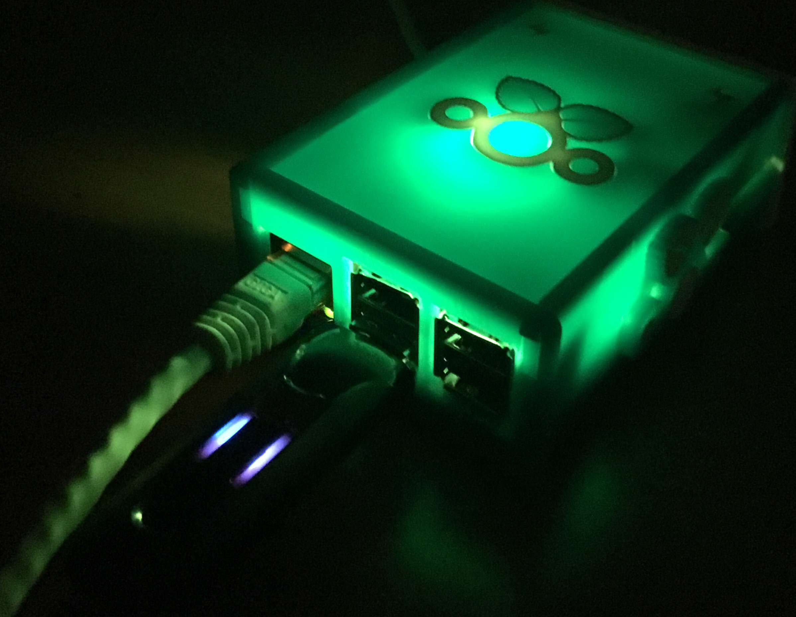
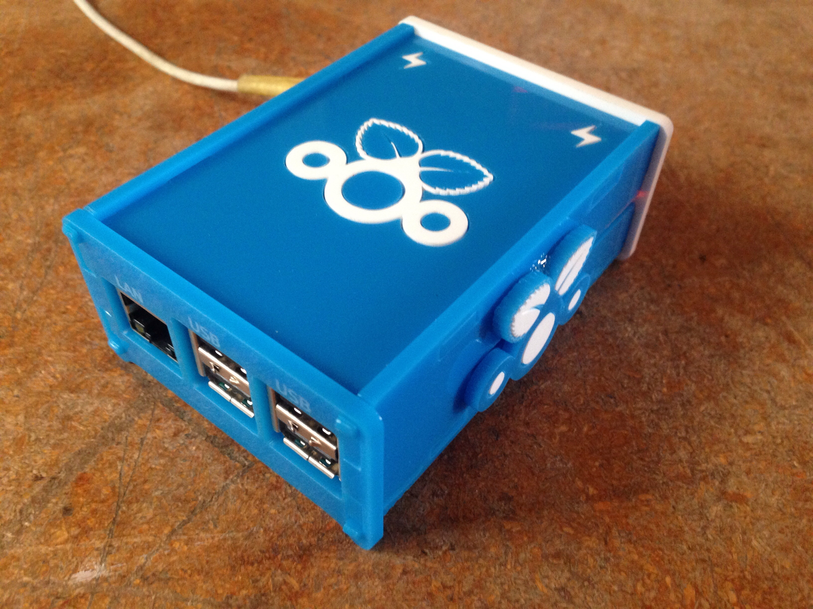
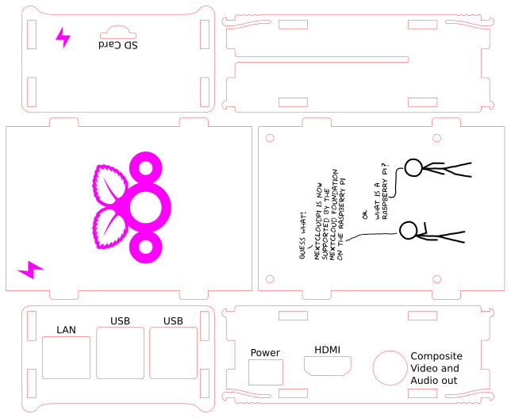
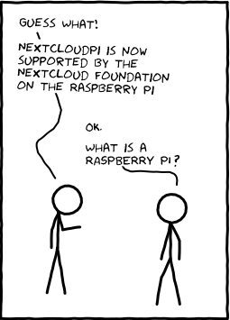
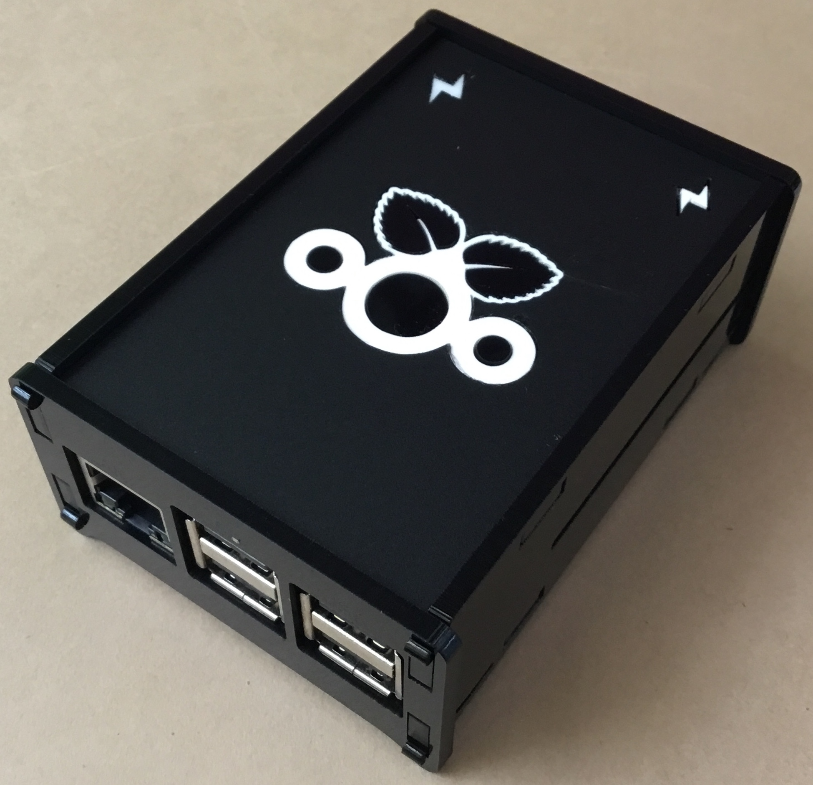

Raspberry Pi Model B+, 2 B and 3 B Case -- [NextcloudPi](https://github.com/nextcloud/nextcloudpi) Remix
==================================
    
This is a simple or quite complex acrylic lasercut case for the Raspberry Pi Model B+, 2 B and 3 B.  It is my love letter to the [NextcloudPi project](https://ownyourbits.com/2017/02/13/nextcloud-ready-raspberry-pi-image/).  I've added an activity icon, same used by the [Nextcloud project](https://nextcloud.com/), to be lit up by the Pi's built-in activity LED's on the front and top of the case.  Optionally, you can choose to inlay the case as I've done + add an optional GPIO 5mm LED that looks awesome and is controlled via python commands.
    
**Simple option** is to raster etch the logo on a single color of 3mm Acrylic.    
**Complex option** is to inlay two contrasting colors of 3mm Cast Acrylic, as seen in the photo, such as blue and white.  To inlay the acrylic you'll need to glue it by hand (instructions TBA).  For my personal cases I also decided to expand the PI's lighting by creating an additional 5mm LED header on the GPIO, which is controlled by python commands (TBA if requested).

Build Instructions
------------------

    pink:	raster engraving
    black:	raster engraving
    red:	cut

Detailed instructions coming soon for the case and 5mm LED gpio expansion.™

BOM for Case
---

- 3mm acrylic
- 4x M2.5 10mm screws
- 4x M2.5 screw nuts    

License
-------

 raspberrypi-b-plus-case by <a xmlns:cc="http://creativecommons.org/ns#" href="https://github.com/diy-electronics/raspberrypi-b-plus-case" property="cc:attributionName" rel="cc:attributionURL">https://github.com/diy-electronics/raspberrypi-b-plus-case</a> is licensed under a <a rel="license" href="http://creativecommons.org/licenses/by-sa/4.0/">Creative Commons Attribution-ShareAlike 4.0 International License</a>.

Raspberry Pi is a trademark of the Raspberry Pi Foundation

Based on the [Adafruit Pi Box - Enclosure for Raspberry Pi Model A or B](https://www.adafruit.com/products/859)
